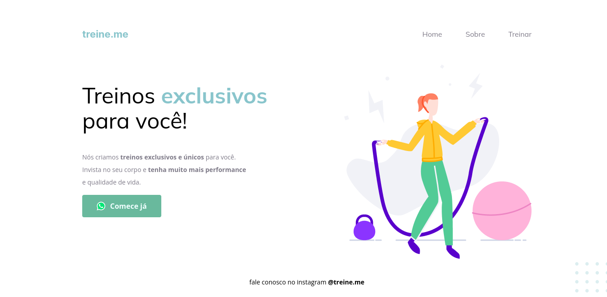

# Treine_me_proj_end
### Train Me
  - Project Stage 02, activity 03, week 02. Learning: Semantics and accessibility.   
  - Rocketseat-Explorer

## Image from the final project:
 

--------

💻 About the challenge
Most of the content available on the internet today can be made accessible only with the correct use of HTML elements.

I received a code with the project developed during Phase 02, but contrary to what was done in class, it does not present the correct semantics.

The page is still working normally but when I opened the code, I find myself with the HTML elements all messed up.... 👀

-----

Watch it in action Deploy: [Click Here](https://ludiemert.github.io/Treine_me_proj_end/)

-----

What was developed:

- Structuring HTML with semantic tags;
- Improvements in accessibility and adjustment in the project;
- Added WhatsApp Button;
- Position of elements on the screen;
- Import external CSS file into the project;
- Applying custom fonts (typography) in the CSS file and starting the external CSS;
- Working with colors and fonts;
- Background linear-gradient;
- Aligning and positioning texts and elements;
- Applying the spacing;
- Borders and element classifications;
- The CSS Box Model concept;
- Use CSS variables to manipulate the project's color palette;
- Hover effect on HTML elements of links;
- Reset CSS removing possible inconsistencies between different browsers;
- Project file system structure separated by folder.

--------

I applied my knowledge of the Explorer from Rocketseat concepts in a practical way 
to this project, with the lessons:

- Introduction to HTML and CSS;
- Getting to know new concepts of HTML and CSS;
  
<br />

- [EXPLORER - Rocketseat](https://www.rocketseat.com.br/explorer)
- [Design Figma - Treina Me](https://www.figma.com/file/rkDOHGPwwFtBNqEdHSuQPd/Projeto-02---Explorer?node-id=0%3A1)

--------

## 🧪 Tools

Application developed using the following tools:

- [HTML5](https://www.w3schools.com/html/default.asp)
- [CSS3](https://www.w3schools.com/css/default.asp)

## 🚀 Getting started

Live server with VScode or just clone folder and access index.html

-------

Clone the project and access the folder.

```bash
$ git clone https://github.com/ludiemert/Treine_me_proj_end.git
$ cd treiname
```

-------
## ✒️ Authors

 * **Rocketseat**

* **Luciana Diemert ** - *Trabalho Inicial* - [Lu Diemert](https://www.linkedin.com/in/lucianadiemert/)
------------------

## 🎁 Thanks to: 

* A equipe Rocketseat


